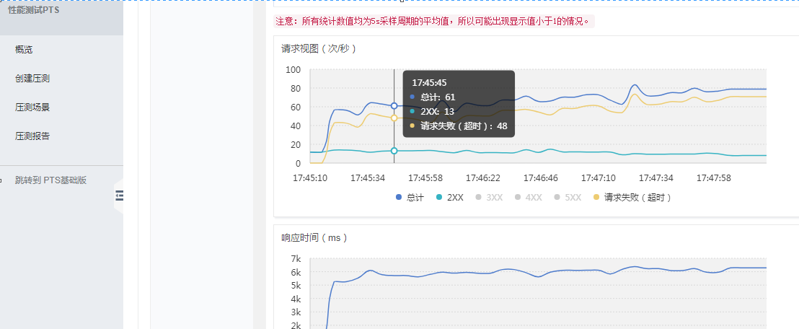
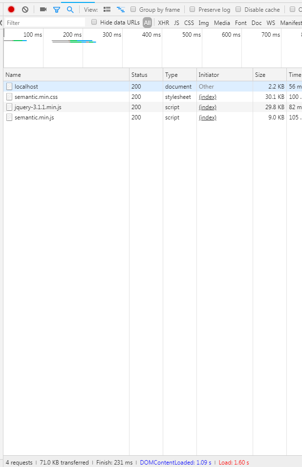
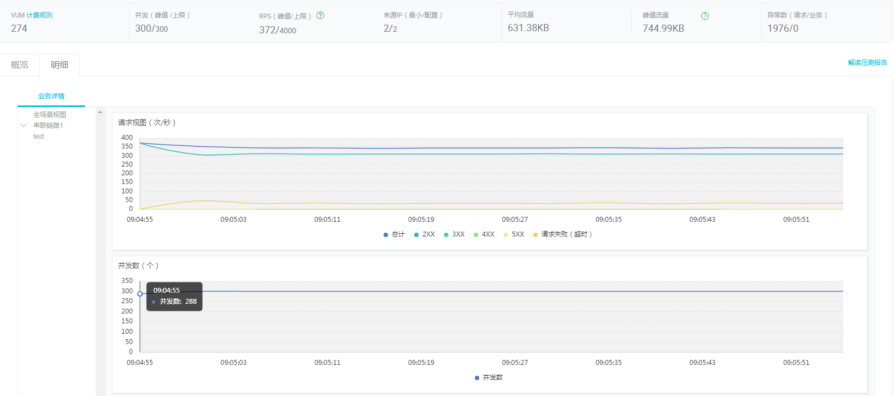
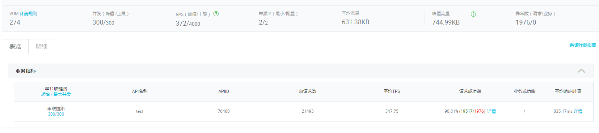
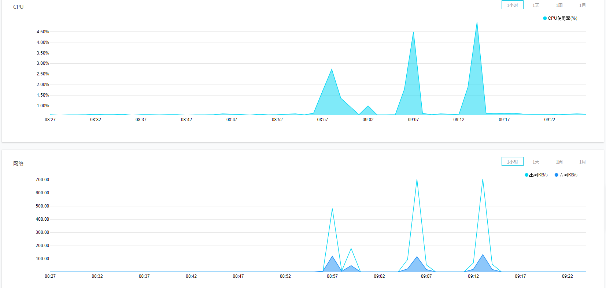

# selecttime

selecttime一个简单的抽签系统。

在实现这个系统的过程中,我发现了大家（大概200人）并不能同时打开抽签网页完成抽签，这让我注意到并发访问的问题，之后用了一些方法解决了这些问题。

## 如何运行代码

```
 git clone https://github.com/assmdx/selecttime.git
```

- 安装依赖

```
 cd v2/server/node & npm i
```

- 调试

```
nohup node index.js    
```

- 配置nginx

```
server {
    listen       8888;        

    location / {			
		root	/selecttime/v2/ui;
		index  index.html index.htm;
	}			
	location /select {
		proxy_pass http://localhost:22020/select;
	}			
}
```

测试：

  http://yourServerIp/:8888

## v1版本

### 基于redis

每次从redis时间数组中抽取一个时间，然后和用户信息绑定存储在redis中，把redis存储时间的数组中的这个时间去掉

时间应该也是在O(1)时间内，用到了redis数据库，应该不是最优

### 测试结果



如上图所示，80个人同时访问的时候，能够正常响应的大概13个人，平均响应时间6000ms+

开始的时候我以为是js计算会消耗大量的时间，去掉了js计算，改为redis直接取之后，响应还是没有改善，

后来，问题实际上是前端页面太大，如下图所示：



小小的前端页面占了70KB，，==||

## v2版本

#### 抽号码逻辑优化

使用redis直接取的方法虽然是O(1)时间的，但是实际上是没有必要使用redis的，对于小数据量的数据可以直接存在内存里，打表，直接取。

打表：人数固定，直接先把数据计算好缓存下来应该还会节省很多时间，也就是从第一个人到最后一个人直接对应到相应的1到n时间，存到一个map中，每个人发请求直接取数据返回即可。

采用直接打表方法返回数据班版本：`v2/server`目录下，分别使用了node和go实现.

#### 前端页面优化

之前最开始并没有进行优化，直接把sematic整个包拿过来使用，300KB+

- 只使用用到的sematic模块，如上图所示，一个抽号码的网页要70KB
- 去掉sematic和jquery
- 优化后的页面总大小：4.23KB  ，效果和优化之前几乎没有差别
  - v2/ui/index-compress.html
  - v2/ui/index.css
  - v2/ui/index.js

#### 阿里云压力测试结果

- 300并发数:基本能全部正常响应，平均响应时间835ms. CPU基本没咋占用 4%，网络 500KB/s（500并发测试情况下）接近满负载

- 网络 700KB/s（500并发测试情况下）接近满负载

  

  

  

#### Jmeter测试结果

Jmeter测试结果基本与阿里云测试结果差别不大，测试文件：`v2/test/selecttime.jmx`

## 相关知识

### **BW = PS * PC * 8 bit /byte * r/t**

BW为带宽大小，

PS为页面平均大小，

PC为并发数，

8bit/byte是单位转换，

1byte=8bit，

r是因数，代表极端情况，作用跟并发估计中的f因数差不多。

t指用户能忍受的平均最大等待时间，比如20秒之内网页没有完全打开，用户就会离开，则t取20秒。同样，这个公式估计的也是单个服务器的带宽需求，或者是网站的总带宽需求

### 阿里云学生版主机

> 1核CPU 2GB内存
> 40GB SSD
> 5Mbps 峰值带宽 625KB/s
> 1000GB 流量包 

