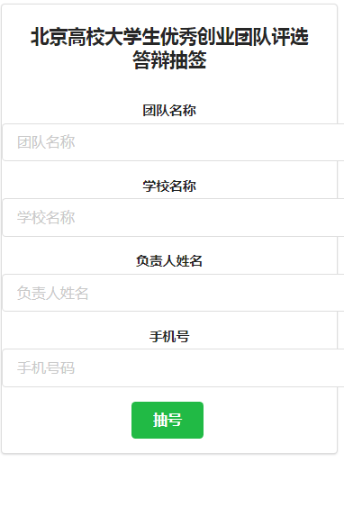
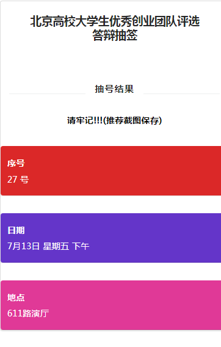
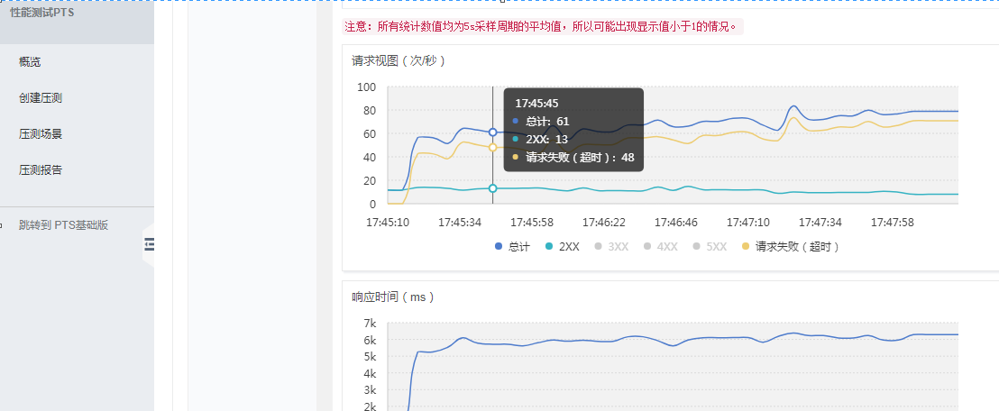
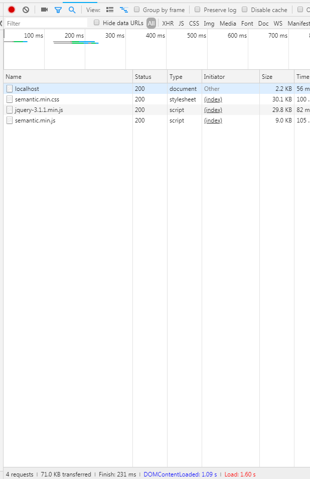

# selecttime

  一个简单的抽签系统

### 界面
  
  

### 如何使用

  git clone https://github.com/assmdx/selecttime.git

安装依赖

  npm install

  sudo apt-get install forever

启动

  ./run.sh

确保你的nginx的配置和 nginx/nginx.conf 配置相同

测试：

  http://yourServerIp/

  http://yourServerIp/manage.html

### 压力测试结果  
**BW = PS * PC * 8 bit /byte * r/t**

BW为带宽大小，

PS为页面平均大小，

PC为并发数，

8bit/byte是单位转换，

1byte=8bit，

r是因数，代表极端情况，作用跟并发估计中的f因数差不多。

t指用户能忍受的平均最大等待时间，比如20秒之内网页没有完全打开，用户就会离开，则t取20秒。同样，这个公式估计的也是单个服务器的带宽需求，或者是网站的总带宽需求

**计算**：

阿里云主机是单核 1Mbps的带宽

网站大小大概是70KB

响应时间 ：231ms

1Mbps = 70KB * x * 8 / 5

1000000 =70 * 1024 * 8  * x / 5 

x = 8

4Gbps带宽的话，同时支持人数大概在 4G /1M * 8 = 32768 大概3万人左右

当时同时抽的人数是80，怪不得会挂掉==

## 设计过程

### 基于json选取

最开始我选择的方法是把时间信息存储在json中，随机选取，每个人抽就从时间数组中抽取一个

### 基于redis

每次从redis时间数组中抽取一个时间，然后和用户信息绑定存储在redis中，把redis存储时间的数组中的这个时间去掉

时间应该也是在O(1)时间内，用到了redis数据库，应该不是最优

### 总结优化（缓存）

#### 抽号码逻辑优化

前两种方法都是要临时计算的，效果可能不是最优，下面的方法（缓存）应该能在O(1)时间内返回结果

参考 https://cloud.tencent.com/developer/article/1007469

如果人数固定的话，直接先把数据计算好缓存下来应该还会节省很多时间，也就是从第一个人到最后一个人直接对应到相应的1到n时间，存到一个map中，每个人发请求直接取数据返回即可。

#### 前端页面优化

之前最开始并没有进行优化，直接把sematic整个包拿过来使用，300KB+

- 只使用用到的sematic模块，如上图所示，一个抽号码的网页要70KB
- 去掉sematic和jquery